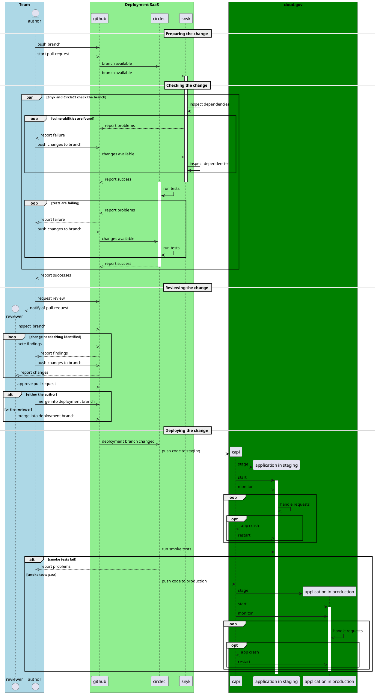
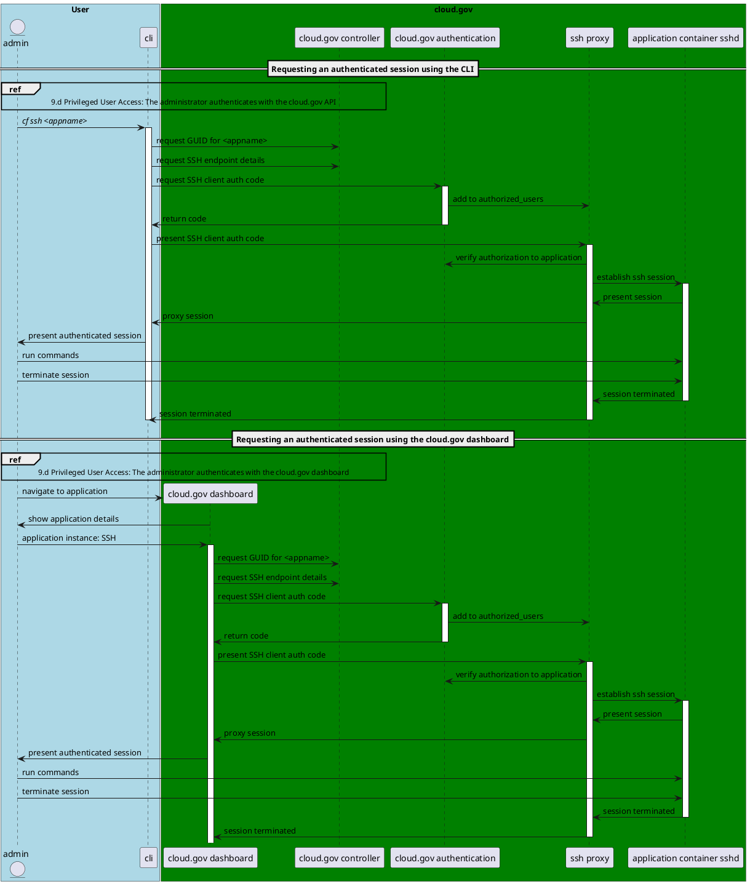

_This scratchpad contains the Markdown/PlantUML source for some of our SSP narrative and diagrams._

# [WIP]: data.gov SSP Architecture documentation

This document attempts to meet the requirements of [#1433](https://github.com/GSA/datagov-deploy/issues/1433) 

## User Story
> 
> In order for the data.gov dashboard to enter the GSA ISE architecture review process, the GSA OCISO representatives require completion of **the first 12 sections** of the System Security Plan (SSP) that covers the data.gov dashboard under the [Moderate NIST requirements](https://nvd.nist.gov/800-53/Rev4/impact/moderate).
> 
> ### Acceptance Criteria
> - [ ] GSA OCISO has an SSP for the dashboard application with reasonable content in **the first 12 sections**.
> - [ ] The data.gov team completes the [ISE submission form](https://docs.google.com/forms/d/e/1FAIpQLSc-sIA2-7nQ8ZBR-HXLFNfYNQteSIqtGNY2rVO6m_34rjXSDQ/viewform?pli=1).
> 

## Notes

- We're using a cloud.gov-hosted instance of [CodiMD](https://codimd.app.cloud.gov/) to collaboratively hack on this document.
- Diagrams are implemented in [C4-flavored PlantUML](https://github.com/RicardoNiepel/C4-PlantUML). Here's a [PlantUMLreference](http://plantuml.com/guide) and [a PlantUML cheat sheet](https://ogom.github.io/draw_uml/plantuml/).
- Layout tips: 
  * > By only using the `->` (right) and `-->` (down) arrows, I already achieved most of the layout. Sometimes I had to reverse the arrow direction `<--` to keep the meaning "down" but draw the arrow the other direction (I normally switch the two elements and do not reverse the arrow).
  * You can use [hidden lines](https://mrhaki.blogspot.com/2017/10/plantuml-pleasantness-layout-elements.html) to help constrain layout
  * You can [group elements together](https://mrhaki.blogspot.com/2016/12/plantuml-pleasantness-keeping-elements.html)
  * You can [extend the length of the connection](https://mrhaki.blogspot.com/2016/12/plantuml-pleasantness-align-elements.html)
  * You can [use angled lines](https://stackoverflow.com/a/48804742)
  * You can [try other tricks](https://stackoverflow.com/a/48735216)


:::info
Text that looks like this is instruction from the SSP template
:::
:::danger
Text that looks like this **needs work** to be acceptable. The styling is used to call your attention to it.
:::

## Sections to fill out

Jason is taking these:
- [x] [10. System Environment](#10-System-Environment)
- [x] [10.c Software Inventory](#10c-Software-Inventory)
- [x] [10.e Database Data Nature](#10e-Database-Data-Nature)
- [x] [10.f Ports, protocols, and services](#10f-Ports-protocols-and-services)
- [x] [11. System Interconnections](#11-System-Interconnections)

Bret is taking these:
- [x] [9. General System Description](#9-General-System-Description)
- [x] [9.b Information System Components and Boundaries](#9b-Information-System-Components-and-Boundaries)
- [x] [9.e Network Architecture](#9e-Network-Architecture)
- [x] [10.b External Services](#10b-External-Services)
- [x] [10.d Data Flow](#10d-Data-Flow)
- [x] [12. Applicable Laws and Regulations](https://codimd.app.cloud.gov/jZHvzdiITWWRrrkA1qUf8w?view#12-Applicable-Laws-and-Regulations)
- [x] [Add New Relic agent to deployed app](https://docs.cloudfoundry.org/buildpacks/php/gsg-php-newrelic.html)
- [x] Add Google Analytics to diagram/description
- [x] Add CF auth to diagram/description
- [ ] List ATO information for GSA-approved SaaS ("Does your software inventory list include a column for GEAR approval status?")

## Requirements
- [x] Is the ATO boundary clearly defined? Are components in scope and out of scope easily referenced? 
- [x] Are all physical and virtual devices, assets, components, and services of the system defined within your ATO boundary? 
- [x] Are authentication points and flows clearly identified? Are the flows for remote management clearly defined? (Helpful Hint: Can an engineer clearly see and follow where a privileged or unprivileged user logins and accesses the system?) 
- [x] Are all network flows in the diagrams clearly identified as inter-vpc, intra-vpc, inter-subnet, intra-subnet, connections to and from GSA, connections to and from the internet, or connections to and from SaaS/Shared services?
- [x] Are all the network flows clearly identified with whether they are encrypted or not? If they are encrypted, does it show the mechanism used to encrypt?
- [ ] Does your software inventory list include a column for GEAR approval status?
- [x] Privileged Users: What MFA solution is in place for privileged users?
- [x] Non-Privileged Users: What MFA solution is in place for non-privileged users?
- [x] Does the SSP/BPD provide a narrative of how both privileged and non-privileged users login and access the system?
- [x]   Does the SSP/BPD narrative support the applicable diagrams?
- [x]   Does the table of user types include a column if MFA is enabled and if so how?
- [x]   Is the latest Ports and Protocols table used and appropriately filled out? (This table includes details for Flow Type, Flow Boundary Crossing, Source, Source, Destination, Port, Protocol, Service, Encrypted (Y/N), Data Sensitivity, and Data Description) 
- [x]   Are all the ports and protocols captured in the table also reflected in the Diagrams?
- [x]   What kind of data does your database store and process? 
- [x]   Does your database store PII, PCI, Authenticators or otherwise sensitive data?
- [x]   If Yes, have you encrypted the data in a table, field, or column with FIPS approved cipher?
- [x]   Does the SSP/BPD include a narrative detailing the nature of the data and the protections in place?


## Related documents
- [ATO Migration strategy](https://docs.google.com/document/d/1Gawt8Sy73mT2E6cRF4k8HOr9WUZZ3BU3fXV-qvvJ71c/edit)
- [FY20 Continuous Monitoring Plan? missing?]()
- [FY19 Incident Response Plan](https://docs.google.com/document/d/1kb5cw1gD6VvfBhaH3BA67M2bEMivng44/edit#heading=h.30j0zll)
- [FY20 Contingency Plan](https://docs.google.com/document/d/1DMtzlU56X1owthQCI6fEuHiTrdDbq-hkeZ4xQC8VLO4/edit)
- [FY20 Configuration Management Plan](https://docs.google.com/document/d/1VLm57NO2uGTFKKVyfUGqzK-BKXrgf91AnPhSWec5CeE/edit#)
- [FY20 Business Impact Analysis](https://docs.google.com/document/d/1eLE_O3mau9C_4jFwkSWAmp3fu0ys1e-7RQ7jHtIj8Jo/edit#heading=h.gjdgxs)
- [FY19 SSP (BSP version)](https://docs.google.com/document/d/110hUAi5gmJ5sGMkNMWefssQBOKhn2wLx/edit#heading=h.gjdgxs)
- [FY19 Touchpoints SSP (LATO)](https://docs.google.com/document/d/1RtMfKUOSPvYtG0XLIusYU-CJv4UM7Lv5UaBzhV6fzzo/edit#heading=h.k66nut4k6csy)
- [GSA IT Security Procedural Guides (_many_)](https://insite.gsa.gov/topics/information-technology/security-and-privacy/it-security/it-security-procedural-guides)
- [OpenControl diagram tips](https://atos.open-control.org/tips/#systemnetwork-diagrams)
- [Software Architecture Diagram Review Checklist](https://c4model.com/assets/software-architecture-diagram-review-checklist.pdf)
- [cloud.gov CIS/CRM worksheet for data.gov](https://docs.google.com/spreadsheets/d/1hnDH3DSbRMBsi6SFpQb0ZvJTlDRC57hGT1RtXQb_aZA/edit#gid=328865104)
- [Source-of-truth for compliance docs](https://drive.google.com/drive/folders/0B5Pp9m0GlZnvNnRiWEpCZGZFQnM)

## Related diagrams
- [Touchpoints LATO system diagram](https://drive.google.com/file/d/1U3KEpXEhb_kGdVHIOLNP-IIcBUass1_k/view)
- TTS examples: [1](https://docs.google.com/drawings/d/1nwclBJQfbuzsnGOqe88VukQl3uiH1Jfa4c0FT1Cq43I/edit), [2](https://docs.google.com/drawings/d/1k1wykk5PbLKSNJj8FyZbIlpX0D8r1q3-w-uRK_WWt9g/edit), [3](https://docs.google.com/drawings/d/10cH-OUB1NWzCI0v9LPzm7AXCfrHXNkDgnae-7hcUFu8/edit)

# Content starts here!

## 9. General System Description

The services provided by Data.gov (in scope for this SSP) are:
- Project Open Data Dashboard (PHP web application)
  A dashboard for measuring open data progress by agencies per OMB Directive M-13-13. The dashboard also provides a number of lightweight converters and validators and serves as the location for support tools provided by Data.gov for agencies.

www.data.gov logical view

```plantuml
@startuml
!include https://raw.githubusercontent.com/adrianvlupu/C4-PlantUML/latest/C4_Context.puml
LAYOUT_WITH_LEGEND()
title www.data.gov logical view
Person_Ext(personnel, "Data.gov PMO", "A member of the data.gov PMO")
Person_Ext(public, "Public", "Member of the public")
'note left of personnel : In java, every class\nextends this one.
Boundary(atob, "ATO boundary") {
    System(dashboard, "www.data.gov", "data.gov program content")
}
Rel(personnel, dashboard, "manages program information")
Rel(public, dashboard, "consumes program information")
@enduml

```

catalog.data.gov logical view

```plantuml
@startuml
!include https://raw.githubusercontent.com/adrianvlupu/C4-PlantUML/latest/C4_Context.puml
LAYOUT_WITH_LEGEND()
title catalog.data.gov logical view
Person_Ext(personnel, "Agency Personnel", "A federal employee/contractor")
Person_Ext(public, "Public", "Member of the public")
'note left of personnel : In java, every class\nextends this one.
Boundary(atob, "ATO boundary") {
    System(dashboard, "Catalog.data.gov", "Schedules harvests and stores records of known datasets")
}
Rel(personnel, dashboard, "manages harvests settings for own agency")
Rel(public, dashboard, "search, review and download open data")
@enduml
```

inventory.data.gov logical view

```plantuml
@startuml
!include https://raw.githubusercontent.com/adrianvlupu/C4-PlantUML/latest/C4_Context.puml
LAYOUT_WITH_LEGEND()
title inventory.data.gov logical view
Person_Ext(personnel, "Agency Personnel", "A federal employee/contractor")
'note left of personnel : In java, every class\nextends this one.
Boundary(atob, "ATO boundary") {
    System(dashboard, "Inventory.data.gov", "Publish open data and manages metadata")
}
Rel(personnel, dashboard, "records of datasets, uploaded data content from agencies")
@enduml
```

dashboard.data.gov logical view

```plantuml
@startuml data.gov logical view
!include https://raw.githubusercontent.com/adrianvlupu/C4-PlantUML/latest/C4_Context.puml

LAYOUT_WITH_LEGEND()
title dashboard.data.gov logical view

Person_Ext(public, "Public Dashboard User", "A member of the public or agency personnel")

'note left of public : In java, every class\nextends this one.

Boundary(atob, "ATO boundary") {
    System(dashboard, "data.gov dashboard", "Displays quality check information data from various agencies. Also verifies uploaded files.")
}

System_Ext(agencysites, "Agency websites", "Main website for the monitored agencies")

Rel(public, dashboard, "view agency reports, use validation forms")
Rel_Neighbor(dashboard, agencysites, "crawls open data information") 
@enduml
```

### 9.b Information System Components and Boundaries
:::info
**Instruction**: In the space that follows, describe the information system’s major components, interconnections, and boundaries in sufficient detail that accurately depicts the authorization boundary for the information system. The desired architecture boundary for an information system should be inclusive of all functions and services necessary to secure, operate, and administer the information system - these include all components and supporting information system components (e.g., logging platform, monitoring solutions, ticketing solutions, vulnerability scanning, authentication solutions, etc.). A system is typically deployed in a logically or physically separated environment situated behind a firewall, with only necessary ingress/egress port openings to facilitate required operations. Integration with assets/device outside of the protected enclave supporting the information system contemplated for an Authorization to Operate (ATO) including to 1) shared assets, 2) corporate networks, or 3) third party services (e.g., cloud service provider (CSP) offerings) are a function of risk. The latter is allowed if the connecting CSP offering is also Federal Risk and Authorization Management Program (FedRAMP)-authorized.  In all cases, integrations with assets/devices outside of the ATO boundary is not guaranteed for approval and reviewed/permitted on a case-by-case basis after a complete understanding of the associated risks. Please ensure that the discussion on boundaries is consistent with the network diagram shown in Section 9.5. For further details, please reference the security engineering guide. 
:::

[This has been written in the table in the SSP draft]

## 9.d Types of Users > Privileged User Access

See section 10 for a description of the interactions between the components supporting privileged user access.

## 9.e Network Architecture

:::info
**Instruction**: The architecture diagram must fully and clearly define the authorization boundary through both pictorial diagram(s) and written descriptions.

Ensure the following elements are incorporated into the architecture diagrams and narratives:
* The network architecture must follow the criteria listed in the Security Engineering Architecture Review Guide.
* The diagram(s) and narratives should include ALL assets, services, devices, and software, both physical and virtual, which constitute the information system.  These shall include all physical and virtual resources. The diagram(s) and narratives should also include any COOP / DR site integrations as well as any test / development environments that are in the boundary.
* If shared assets or services are used, including corporate shared services, they must be appropriately defined and documented as a shared service within the ATO boundary of the system or within the corresponding ATO boundary of a relevant, authorized system. All components must be accounted for within an ATO boundary.
* If on-premise or cloud services are used to support operation, maintenance, management, security of the services in scope of the ATO, be sure they are reflected in the network architecture with related flows. Depending on the nature and type of integration and sensitivity of the data, these dependent systems may also need to be ATO'd; usage considered for risk acceptance; or, if not risk accepted, potentially removed from the architecture.  All SaaS, IaaS or PaaS leveraged that support delivery of the system must have an ATO, approved by GSA or FedRAMP.  For public facing systems, integration with external systems including but not limited to other cloud assets via Application Programming Interfaces (APIs) or third party enablers shall be appropriately secured.
* Ensure all authentication points (this includes but is not limited to AWS console, jump, machine resources, network devices, application, API, enablers, etc. (as applicable)), are defined.  2FA should be for privileged, non-privileged and/or Internet accessible logins within this system (for both customers and vendor staff).  At FIPS 199 Moderate and up, all authentication shall be 2FA; privileged authentication is required to be MFA for all FIPS impact levels.
* The system boundary contains all components, devices, services, communication paths (VPNs, API calls, etc.). Diagram(s) should be sufficiently detailed and identify flows with source/destination, ports/protocols, or whether the related traffic is encrypted or not. References to ports/protocols table(s) are acceptable (for large sets of ports).  Please be sure the tables identifying ports reflect whether they are encrypted or not. Tables should easily track to the architecture diagram.
* All access control mechanisms, such as firewalls, router ACLs, subnets, proxies, and cloud-based analogs such as firewalls and network access controls configurations shall be fully documented in terms of specific access control rules, specifying source, destination, protocol, and other relevant attributes, as necessary.
* The diagram must include a predominant border drawn around all system components and services included in the authorization boundary.  Separate borders around protected enclaves, subnets, and DMZs is also advisable.

:::

:::danger
The following section provides a written description of the network architecture of data.gov.
:::
[Using the Touchpoints narrative as reference](https://docs.google.com/document/d/1RtMfKUOSPvYtG0XLIusYU-CJv4UM7Lv5UaBzhV6fzzo/edit#heading=h.3whwml4)


### data.gov dashboard network and boundary overview

#### Report generation
The dashboard application asynchronously crawls the websites of agencies to retrieve their published data.json and digitalstrategy.json files daily using HTTPS on port 443. The application then generates reports about the completeness and validity of the files' content. 

#### Backend storage
The PHP application accesses a backend MySQL database using port 3306 to lookup information about the agencies that it should crawl, and to store reports that the application has generated. The application also uses HTTPS on port 443 to access a backend blob store where it caches the .json files that it crawls.

#### Application operation
The dashboard application delivers content in response to requests from the public or agency personnel. All users access the data.gov dashboard application via the public internet using HTTPS on port 443. The dashboard PHP code maps requests to "controller" objects using the path portion of the requested URI. The controller objects implement the logic invocable by the public, and is where custom business logic is defined. Controllers manipulate and persist changes to data objects or “models”. Controllers then use "view" objects to generate an HTML, JSON, or CSV response to the request. HTML responses reference static CSS and JS resources at neighboring paths.

#### Analytics collection
HTML pages returned by data.gov web applications include a Javascript tracking script provided by the Digital Analytics Program (DAP), a shared service web analytics tool provided by the Technology Transformation Services (TTS) at the U.S. General Services Administration (GSA). The tracking script reports to the DAP analytics collection endpoint.

#### Application Performance Monitoring (APM)
New Relic is used to monitor application performance by sampling response times. The data.gov dashboard PHP web application also includes the New Relic agent which sends application telemetry and runtime errors to New Relic. New Relic handles reporting and alerting on this data for the data.gov team.

#### Boundary traversal

The only access point visible on a public network is the cloud.gov-operated IaaS-level load-balancer in the AWS (GovCloud) boundary, which terminates TLS for public traffic, and then proxies requests to one or more cloud.gov routers within the cloud.gov boundary. The cloud.gov routers proxy incoming requests to one of many application instances. Traffic between the cloud.gov routers and application instances is encrypted with TLS.


The following architectural diagram provides a visual depiction of the major components of data.gov and the direction of network traffic across the boundaries of the referenced systems. (Systems used in deployment and administration, as well as the content of the staging and management spaces, are described in a later section.)

WordPress boundary view
![www.data.gov boundary view](http://www.plantuml.com/plantuml/png/fLPXRzis4Fqy_ufRFgnEq4XRd6v0KHHLcomjO3TUvS8Rji4uYMU764Mg96NL6_hVTvHiMRQ11SNq8Q6aU-_UqoClUUKyMbyLQl2jrBcg1C63zwLx7iSMwsWb_KELLOviRhGdxQFS534AAr6lLLLMyPlhowb2xJzEnd61pfFbHuitN8rIautAmFq4Ait0WWd0Fn0iZLAcbde5Yei0jO23rz8wNXdWng1CZafjcADJUDfWdFns_t6scB-RlLsCR-zktzyCpmTUUaLGrtKaq6EqCcl8JAK5sWsi9TM3ALbdzB1iVcbIJ-7iPbSvdToVyNq21HKPMJ3BHfhelp_VCYnkF_jXMMLAvWoPDei0dXn0sm86QUC9qC6jpksczDBez_naa2W5UT2HXqSE19KozoG0BG6rjNnNSoGm6wVmGtG5bLRa71ZcjxLq185RH0FIebaENcyD3x5smSuyXJkpVgDC9SxEuPy1yDNLvE4nc-F2PXcCTbNVf1ldgMYyCja2LTQl0sLGN6QeKETapxQzal5hDWpRQy_GjLfOKtcoNFxYEuKRikubx3dRbowmDPBXvo2Lu_CMbqkPWoExbZdrUkmDUnC4Te4bi_ik_ixKaR8EBD0zP0Qjw3EyqslItfp2cwlRaNlm0ilomDbyFeUaB9NCCMGSV4tVJk6dw3eQFOMviQAq8SzdqLNqO_EMRxcdW-tn0sGB_d0dbjQiB1RX6_IkBuFJLIVn9kk955beP9nVMKf_6KCu0XawscNuuIODoosu9qMBi5xALMKREx0qDaZh6N7I4qWT3k4bbYLh_6yjRhHjceuWg_A_o1-fIBrXOd2UE-Qmb8e0dIFlcBer-sNGssRtazSCufymINvjg2eMgFqs04WS8AJT9khoNpbSE4J7YBiqkKH66Il_9W4fOjhatpyF0aFEDycqQQ5HRRX3-59AjQUPkVlrccfBxRHuJpLyeDt0C5fwRgHNspxiffjESFaIk14yXuiBIwMnta7bS4KN5_27ZkFVcy4Dm-lhqVcVSJnevytNebZByGRkgTqnU59KaBUReDhdPOjdlGplpzFze2XGu-fqruBKl6kAxZYqQkvkP_7qFfqTqZP--fovqQug_XTfHtOwa9ZiioG7bZvLvBnxXEc4uE0hVXtV0HHUS8IyXPi8SRz_oUqYJ9F96AwYxqD-Jqu3XFOKzA5DyntiDBOMi2OhbnkG8g3yvX7_HpsFveib52wkhUJUxP_q9ZL77Ypbnef6KUa-AHW-knvTFShgHiUiWMytd4x9Nf4MuJ-5Vm40)

```plantuml
@startuml
!include https://raw.githubusercontent.com/adrianvlupu/C4-PlantUML/master/C4_Container.puml
' uncomment the following line and comment the first to use locally
' !include C4_Container.puml
LAYOUT_WITH_LEGEND()
title www.data.gov boundary view
Person(personnel, "Data.gov PMO", "A member of the data.gov PMO")
Person_Ext(public, "Public", "Member of the public")
note as EncryptionNote
All connections depicted are encrypted with TLS 1.2 unless otherwise noted.
end note
Boundary(aws, "AWS GovCloud") {
    Boundary(cloudgov, "cloud.gov") {
    	System_Ext(aws_alb, "cloud.gov load-balancer", "AWS ALB")
        System_Ext(cloudgov_router, "<&layers> cloud.gov routers", "Cloud Foundry traffic service")
        Boundary(atob, "data.gov ATO boundary") {
            System_Boundary(dashboard, "data.gov Inventory") {
                Container(dashboard_app, "<&layers> WWW Application", "PHP 7.4.3, Wordpress 5.2.6", "Presents content about the data.gov program")
            }
        }
        ContainerDb(dashboard_db, "PostgreSQL Database", "AWS RDS", "Contains content and configuration for the Wordpress site in www-app")
        ContainerDb(dashboard_s3, "AWS S3 bucket", "AWS RDS", "Stores static file assets")
    }
}
System_Ext(OMB, "OMB MAX", "Authentication As a Service")
Boundary(gsa_saas, "GSA-authorized SaaS") {
	System_Ext(dap, "DAP", "Analytics collection")
	System_Ext(newrelic, "New Relic", "Monitoring SaaS")
}
personnel -> dap : **reports usage** \n//[https (443)]//
public -> dap : **reports usage** \n//[https (443)]//
Rel(dashboard_app, newrelic, "reports telemetry", "tcp (443)")
Rel(personnel, aws_alb, "manage data.gov program information", "https GET/POST (443)")
Rel(public, aws_alb, "consume data.gov program information", "https GET/POST (443)")
Rel(aws_alb, cloudgov_router, "proxies requests", "https GET/POST (443)")
Rel(cloudgov_router, dashboard_app, "proxies requests", "https GET/POST (443)")
dashboard_app <-> OMB : **authenticates** \n//[SAML 2.0]//
'Rel(dashboard_app, OMB, "authenticates", "SAML 2.0")
Rel(personnel, OMB, "verify identity", "https GET/POST (443)")
Rel(dashboard_app, dashboard_db, "reads/writes local dataset records", "psql (5432)")
Rel(dashboard_app, dashboard_s3, "reads/writes data content", "psql (5432)")
@enduml
```

Catalog boundary view
![catalog.data.gov boundary view](http://www.plantuml.com/plantuml/png/bLRRRjj647sklcBgXyOsOh6rN208WY3qfKvGsLPC1MdH5i9eToInNUqoiqifR95_xomfKHUXDS87QxsSEMSkPqPwumDoAEUcysrkbIarmIo4mhzC4iPbTvg7MJakFR5oDf0DNUNc2MhEqIvCMPJ9rSNPmA0D7-xwoHnz89QhqPLOOsw9kqN4VWQb5SUv042O4KoSCMwPsoaOCGAq6dPUv-pbv428mJY5nbI2qKPuID1FVttuC1nzV3TyE-hVtDxSNn-VT48U3872WCPDkre-krEtWB4hhKQkO97JiZCWziwERZw7uw8-MZBFuIYTabKL3DPNH_4E9gI9qG3D2-CgeYHMXL45nqSdEr3bsEHAV0Rr8NhVqNnC36vIfzWOY9DrWG0zt5Z5LH5oP-_bffCQ0oeogtZbGLEHgq0Qa0ceiPN_bj8V6FOp-A5x3gKrv3qumUTbxWaYjkvsoEhwsBbSPNwCIn_p-PZ1hLjS6LVgenFufmFoj3OgNakznB0-njgrLjzabGyqZxb6i16QyROT68VwR8m6hI8-Md6b_Kj965RF1g6b6h4h0x6Ol_hEO4NiNyC6itdf8reTClmKG-KA0kDaaYlmn8jSqHR79k7WOe2j1jBXGwk3Dgczo5fdZNusTiXw6-6TNP0DRjUzVLfvRfn7M1GxcLqrmeIqA4GA6FiSSnjKOUOizBelkhtdSFLpUW_dtHVr6oOld1uGF26h6P2TvZQE4yES0iRW02Ml018YiQqdoXLaeOuRCZKZNHhozSXnQRs8aLqvdGdcfv9AYlgS8I_8XpYUVxgnc3XWcWZvJ3wLO-sZrL_MBHjSJy4tHM-VBvt3KrkJw_5MLVGuPkPyc39bx_jmBO1ZWLoBvl4wYyUtpkWOB3qLmlzG-Pu0FPBEFRoNNF-RmWSCj9xK_R8qDOabZs_dGWEurS6JJfFrbywMm1_kBeL0_i9T-ajDMugp3IidI6DFirQ-hVAc7aSUCGxhRPQUeNWvplyc3HbYLYjlUn8rHeLTfuEQmgAfXC63SiQGQgBRiRUqP6hsr3qjuP7MgyhPF3YE0cXu99jsESBPQn0YU0cdfqo5u-2Xz3YbqrFutIR9R_Nt1nnVNFHE_aYIJhFfljPBOjaVdQrermY138dmkOfH1rKq_XAlk6-lyysAcgCLqbepRKEzArcHZnXD5BStmsJma0rtu9eyjh5MGnX7IOiGuyvhlo7QeNi2jKKxt845kyyvUM0I2VhmL7m70Blb-ogy7LTu9RsBseszmurmoQzxbwLtVLbItyV6FJli73Jott6Dv6ktmtur3WlYV591hgDNg9x8VuzpRyCmeVR9adFXRdvIhFV6Ug54-C9_Cd3yuqNl_4bKtzj7ZNYm-fbq2FQ6h2xdvby0)
```plantuml
@startuml
!include https://raw.githubusercontent.com/adrianvlupu/C4-PlantUML/master/C4_Container.puml
' uncomment the following line and comment the first to use locally
' !include C4_Container.puml
LAYOUT_WITH_LEGEND()
title catalog.data.gov boundary view
Person_Ext(personnel, "Agency Personnel", "A federal employee/contractor")
Person_Ext(public, "Public", "Member of the public")
note as EncryptionNote
All connections depicted are encrypted with TLS 1.2 unless otherwise noted.
end note
Boundary(aws, "AWS GovCloud") {
    Boundary(cloudgov, "cloud.gov") {
    	System_Ext(aws_alb, "cloud.gov load-balancer", "AWS ALB")
        System_Ext(cloudgov_router, "<&layers> cloud.gov routers", "Cloud Foundry traffic service")
        Boundary(atob, "data.gov ATO boundary") {
            System_Boundary(dashboard, "data.gov Inventory") {
                Container(dashboard_app, "<&layers> Catalog Application", "Python 3.8.3, CKAN 2.8", "Presents a search engine for metadata about government open data. Schedules and runs through a queue of harvesting jobs to refresh records of known datasets")
            }
        }
        ContainerDb(dashboard_db, "PostgreSQL Database", "AWS RDS", "Holds the records of known datasets")
        ContainerDb(dashboard_s3, "Redis Queue", "AWS RDS", "Holds the state of the queue of harvest jobs for the main application")
    }
}
System_Ext(OMB, "OMB MAX", "Authentication As a Service")
Boundary(gsa_saas, "GSA-authorized SaaS") {
	System_Ext(dap, "DAP", "Analytics collection")
	System_Ext(newrelic, "New Relic", "Monitoring SaaS")
}
personnel -> dap : **reports usage** \n//[https (443)]//
public -> dap : **reports usage** \n//[https (443)]//
Rel(dashboard_app, newrelic, "reports telemetry", "tcp (443)")
Rel(personnel, aws_alb, "manage data harvest sources", "https GET/POST (443)")
Rel(public, aws_alb, "search and download federal open data", "https GET/POST (443)")
Rel(aws_alb, cloudgov_router, "proxies requests", "https GET/POST (443)")
Rel(cloudgov_router, dashboard_app, "proxies requests", "https GET/POST (443)")
dashboard_app <-> OMB : **authenticates** \n//[SAML 2.0]//
'Rel(dashboard_app, OMB, "authenticates", "SAML 2.0")
Rel(personnel, OMB, "verify identity", "https GET/POST (443)")
Rel(dashboard_app, dashboard_db, "reads/writes local dataset records", "psql (5432)")
Rel(dashboard_app, dashboard_s3, "reads/writes data content", "psql (5432)")
@enduml
```

Inventory boundary view
![inventory.data.gov boundary view](http://www.plantuml.com/plantuml/png/bLNlRzis4Fqy_HMtV5YJeB6sEWEAe2Yg_5XQp4cyoa4xR8Dn5iys0PfKISgkDlH_tvriorOCj9i_10VgxhsxntVCcn3HnsfXak-rBKob2EOnbk4YJJskUZCTvzMa2kGBPoFPs2lS8aNbDTgbgSeglJe_6ngqyV5ka2umHF9yDBxYRDIMVAyKx6TGMIvSC034ES7K6UDMsix0S1AWLT3vh7tWo04JWt456bCpHjlX8S4W-_tXSJJ-y6xqTZoukRsvlpu-IQAEXa3R9UCwN_SKHkpDt18chh8AVGrBJQjaI3uuExxv78_B9hHadiDHDYDRr33S7Xt96Kn9aKS3j2YDgubIqSLZmGH79ubraG03tDZ2rsNKpjxpIP8P0uM0578KG56fYqWAq1FGEfSKh5Xi60ro-AdtWWKp508uriElT20GRDLBoAecJ2utGnpZAaXh7tAuTSihuofrT0B_9C2_DgUGOnwT4vjGP6Yplilh46aX2WZO6CraFm-CGtKsGOEs87-quSe6bpmmR7uxX9Pgx5qLoNFwgnyCrkJ3QzXXhZy6GMjQXb-aLLz3z3YTwW82-QKkQ8zZDt1qqc1xdTdeeRtITgWddRN52iDyuj2hVOHtMuySbCklzTgkU8nbsPciHO2iB8qkK6vQfXlMSUuiz7ilU_tdSFLhTWylUY-RBvu2rmH0UFp8A-41rvQJTGjY_xAQ61tcm2sIjyrwk98iID_Dqg1IiA28pI2m1pX7loJP8VGpYWBUB5R1USRDWBiN_4yLoSYTWRyaXr4hmFLaJm8raI5SY3DF-My3k6Rm2GRQEkJzTIxXMsTKQDWz5SvpxARRfJwhIZ4NgMQaG35mDrzd3Vt_nBgx3qd8EQ8BMBSYLB1vpg1jO59tv9S-6Ws-97lUVhYxP6p-2tVPnuQnui5itDmtPA9ztZgtDTqiu3WWofxUvjaPSfNp-c-cpH7pndJxIwXGp7MT3HiAYwPcXi0z6xD-GXXxFz_IoXERZhFlQGNl9PRIEsTrP28xs_3mDEqJ1sUlWOdW0avFFPNEny2ZimQdf_2dJTC_cly3S7n-tZ_vAqqJHdtg_ptUBK8aG-n8Nmj_BCfrFJDp-VxpkdjdjYRlEdk1bbjfpIrewtvkRqRfy24VTO1RjCF7f_JkiwO0djZj8OPl81q0T4V-NtYTKdZ5UejpH6_SsOR2Lkyyknlms_2ZYFtiK6rOcwzJAkJRiaEDrmLBydfQWrPI5UklpN_8-MJRFQ4AwSfhvbxly7Pnjyijy6NuPE3uv_F-Ys-YXduNjRkTXs1loAfgOVu5)
```plantuml
@startuml
!include https://raw.githubusercontent.com/adrianvlupu/C4-PlantUML/master/C4_Container.puml
' uncomment the following line and comment the first to use locally
' !include C4_Container.puml
LAYOUT_WITH_LEGEND()
title inventory.data.gov boundary view
Person_Ext(personnel, "Agency Personnel", "A federal employee/contractor")
note as EncryptionNote
All connections depicted are encrypted with TLS 1.2 unless otherwise noted.
end note
Boundary(aws, "AWS GovCloud") {
    Boundary(cloudgov, "cloud.gov") {
    	System_Ext(aws_alb, "cloud.gov load-balancer", "AWS ALB")
        System_Ext(cloudgov_router, "<&layers> cloud.gov routers", "Cloud Foundry traffic service")
        Boundary(atob, "data.gov ATO boundary") {
            System_Boundary(dashboard, "data.gov Inventory") {
                Container(dashboard_app, "<&layers> Inventory Application", "Python 3.8.3, CKAN 2.8", "Presents a UX for agency users to publish government open data and add metadata. Presents a harvest target for the catalog app to query")
            }
        }
        ContainerDb(dashboard_db, "PostgreSQL Database", "AWS RDS", "Holds the records of locally-uploaded datasets")
        ContainerDb(dashboard_s3, "PostgreSQL Database", "AWS RDS", "Inventory DataStore: Holds data content uploaded by agency users")
    }
}
System_Ext(OMB, "OMB MAX", "Authentication As a Service")
Boundary(gsa_saas, "GSA-authorized SaaS") {
	System_Ext(dap, "DAP", "Analytics collection")
	System_Ext(newrelic, "New Relic", "Monitoring SaaS")
}
personnel -> dap : **reports usage** \n//[https (443)]//
Rel(dashboard_app, newrelic, "reports telemetry", "tcp (443)")
Rel(personnel, aws_alb, "publish open data and manage metadata", "https GET/POST (443)")
Rel(aws_alb, cloudgov_router, "proxies requests", "https GET/POST (443)")
Rel(cloudgov_router, dashboard_app, "proxies requests", "https GET/POST (443)")
dashboard_app <-> OMB : **authenticates** \n//[SAML 2.0]//
'Rel(dashboard_app, OMB, "authenticates", "SAML 2.0")
Rel(personnel, OMB, "verify identity", "https GET/POST (443)")
Rel(dashboard_app, dashboard_db, "reads/writes local dataset records", "psql (5432)")
Rel(dashboard_app, dashboard_s3, "reads/writes data content", "psql (5432)")
@enduml
```
dashboard.data.gov boundary view
![dashboard.data.gov boundary view](http://www.plantuml.com/plantuml/png/bLL_RoCr4FsR_HH3_u2qQdSfgK0weTEbJMXFIjjmcwD2WA9PUv8OUUqzsvkz1TrtntQIJT80vQogSkoPzzxyyEmRwz2ukfJ9bq8nMNE2fNELVPLb1fjq8TooBcfBXcdbIBcKwJ93RWIgbQohEhkvkfX8LExz_JWhqJeo_cXsuwrHA39f5R2_Xbfvnz83W5iIpBMKkX5g0T8R0IeE1zV2MB_Ju8b1QePIjXwZKtXCa8m7lpo-dywUtaxlPkFHxUXXs3jDd72IWADT5XeDJpawJ1Tw1OMk5KVJmafGaoJ9X8pLQZRww7fLNKZ1pk5a4ZSmt7h3pzwMp8c_6a19PK46z3pgNVk0De0BKgo5Ak8faYUdIQAq8q0B8yLCMpcXrOC_IGPI0Wj6B1nPu5G9veW36WAAjk5Nuoi0qt4Eb-ctK2j9reBsfAOHbY1WypGXnUCsIQutaVMmiK7fKmwtUdKZTSrFJk6l1FoA_pf35kvyKhnrt8O4TQPVvArrLCRCUCGPocBV3gH6Vb6WHCLYQYBXO7pjuuRDsY5qL3EZQqV6c__mbSIMZ7qDEyprfGreKJVy6AIQ5fp1-Lmmi6HMWj4UnovgfuF0hj23wMDNx2wePyewvwvHzX6wmoFtiBest3dFiAeE8dkY0WPL9GN3KEaGr-Hk0j-dLsd_t2DmUhjGmf61VdgPNbu6WrlocEZ8Wg5A6sVZ6-4anSfZWdKUYi7Tr3-wcpoFbtDjIhlBILoVakDT9tbOx8dc8MttRVxJ68Rei41BstA-6-PXcpjjo6uxNAZ05mEAx6kPdly57jltKDTI5n3mEewy7ykDREafcC564eTOWp_iXe6BXN0ehGjvMRJhYxcG54bZY9_s-p_g3F1nSzG9a1pqTZIomf4zgDt6kQ4YtWMHzoZKzY0aFKw0KYiHuk4GaKGKjIzdON5c4MseRJwumDejjH5_UeSSCJyMn34qqN0mYHbIA5idc0McfLmF38-_Rw-eCRGUN0_KmBkmZshNmiAeZKHHrMPUNRm6JmEluEnissMrzVhFpk0tbMM_nWy1zAwk-gU_PrdYCPzt-Hxh5i6Hf9ASQGExOzNQFyp10D2Drzqm2IEuw-ZDLoOMV8LIyFW6TeqGwnsGrzfkHzDiyfXFEv90qK4VZvlAw8yYFgeFDLdt4j8Hm47uduqtUo2nyFv7m-Am-sBxs__V_GUSTwF1SCi9_rIoPq_U4FA3HtqEyIXhZDWRFzxI_vMj_I2Xr-z_yvs7_s_q-D2jqsRteF-jUjiKlI75wrB-3G00)
```plantuml
@startuml
!include https://raw.githubusercontent.com/adrianvlupu/C4-PlantUML/master/C4_Container.puml
' uncomment the following line and comment the first to use locally
' !include C4_Container.puml

LAYOUT_WITH_LEGEND()
title dashboard.data.gov boundary view


Person_Ext(public, "Public Dashboard Viewer", "A member of the public or agency personnel")

note as EncryptionNote
All connections depicted are encrypted with TLS 1.2 unless otherwise noted.
end note

Boundary(aws, "AWS GovCloud") {
    
    Boundary(cloudgov, "cloud.gov") {
    	System_Ext(aws_alb, "cloud.gov load-balancer", "AWS ALB")
        System_Ext(cloudgov_router, "<&layers> cloud.gov routers", "Cloud Foundry traffic service")
        Boundary(atob, "data.gov ATO boundary") {
            System_Boundary(dashboard, "data.gov dashboard") {
                Container(dashboard_app, "<&layers> Web Application", "PHP 7.4.3, CodeIgniter 3.1.11", "Generates reports and delivers static HTML/CSS and forms")
            }
        }
        ContainerDb(dashboard_db, "MySQL Database", "AWS RDS", "Stores agency information and reports")
        ContainerDb(dashboard_s3, "Blob Store", "AWS S3", "Caches crawled data.json and digitalstrategy.json files")
    }
}

Boundary(agency, "Agency ATO boundary") { 
	System_Ext(agencysites, "<&layers> Agency websites", "Main website for the monitored agencies")
}

Boundary(gsa_saas, "GSA-authorized SaaS") { 
	System_Ext(dap, "DAP", "Analytics collection")
	System_Ext(newrelic, "New Relic", "Monitoring SaaS")
}

public -> dap : **reports usage** \n//[https (443)]//
Rel(dashboard_app, newrelic, "reports telemetry", "tcp (443)")


Rel(public, aws_alb, "views static content and validates data.json files", "https GET/POST (443)")
Rel(aws_alb, cloudgov_router, "proxies requests", "https GET/POST (443)")
Rel(cloudgov_router, dashboard_app, "proxies requests", "https GET/POST (443)")
Rel_Neighbor(dashboard_app, agencysites, "crawls data.json and digitalstrategy.json files", "https GET/HEAD (443)") 
Rel(dashboard_app, dashboard_db, "reads agency info, reads/writes reports, ", "mysql (3306)")
Rel(dashboard_app, dashboard_s3, "stores crawled files", "https GET/POST(443)")
@enduml
```


## 10. System Environment

:::info
Instruction: In the space that follows, describe the technical system environment and document the architecture requirements identified within Sections 2.1 through 2.3 of this document. Include information about all system environments that are used, (e.g. production, test, staging or QA environments). Ensure that the proposed software stack utilizes current and supported versions. The software stack, including operating system, application, database, etc. must be configured and hardened in accordance with GSA Enterprise Security Benchmarks (per the vendor’s discretion) or to a suitable hardening standard, such as ones provided by the Center for Internet Security (CIS).
The mechanisms for creating, storing, distributing, and signing any encryption keys or certificates in the system shall be fully documented in the security architecture. Additionally, all keys and certificates generated shall be reposed in a manner that assures Business Continuity Plan (BCP), Disaster Recovery (DR) and Continuity of Operations (COOP) consistent with NIST requirement per impact FIPS 199 impact level.
Systems that process PII or other sensitive information (Payment Card Industry [PCI], authenticators etc.) shall employ encryption of data while at rest and while in transit.  Encryption at rest for sensitive information should be encrypted at the database (DB) and/or file level.
Ensure encryption in particular for web services utilizes FIPS approved ciphers; FIPS validated encryption modules, at a minimum TLS 1.1 and up, Hypertext Transfer Protocol (HTTP) Strict Transport Security (HSTS), and HTTP Secure (HTTPS) only.
* Digital signature encryption algorithms - Reference: http://csrc.nist.gov/groups/ST/toolkit/digital_signatures.html#Approved
* Block cypher encryption algorithms - Reference: http://csrc.nist.gov/groups/ST/toolkit/block_ciphers.html#Approved
* Secure hashing algorithms – Reference: http://csrc.nist.gov/groups/ST/toolkit/secure_hashing.html#Approved
* Binding Operational Directive 18-01 - Reference: https://cyber.dhs.gov/
:::

### Boundaries, components, and user interactions
Every data.gov component follows the pattern described below with variance only in the application or data services in use unless otherwise specified.

```plantuml
@startuml
!include https://raw.githubusercontent.com/adrianvlupu/C4-PlantUML/latest/C4_Deployment.puml

LAYOUT_WITH_LEGEND()
title data.gov typical application interactions

note as EncryptionNote
  All connections depicted are encrypted with TLS 1.2 unless otherwise noted.
end note


Deployment_Node(aws, "AWS GovCloud", "Amazon Web Services Region") {
	System_Ext(aws_alb, "Public-facing TLS termination", "AWS ALB")
	Deployment_Node(cloudgov, "cloud.gov", "Cloud Foundry PaaS") {
        System_Ext(cloudgov_router, "cloud.gov router", "Cloud Foundry service")
        System_Ext(cloudgov_logdrain, "logs.fr.cloud.gov", "ELK")
        
        ContainerDb(cloudgov_services, "cloud.gov data services", "AWS RDS, S3, etc", "Stores persistent data for apps")
        Boundary(atob, "ATO boundary") {
            Deployment_Node(organization, "data.gov organization") {
                Deployment_Node(space, "data.gov space") {
					System(app, "application", "data.gov component")
}
            }
        }
    }
}

Rel(aws_alb, cloudgov_router, "sends application traffic", "https (443)")
Rel(app, cloudgov_services, "reads/writes data", "data protocols")


' Logs flow
Rel(app, cloudgov_logdrain, "logs to", "stdout/stderr")

' Customer access
Person_Ext(public, "User", "Agency personnel or the public")
Deployment_Node(computer, "Computing Device", "MS Windows, OS X, or Linux"){
    System_Ext(browser, "Web Browser", "any modern version")
}


' Monitoring
Boundary(gsa_saas, "GSA-authorized SaaS") { 
	Deployment_Node(gsuite, "GSA G Suite", "Collaboration SaaS") {
		System(ggroup, "datagovhelp@gsa.gov", "Google Group")
	}
	System_Ext(dap, "DAP", "Web analytics SaaS")
	System_Ext(newrelic, "New Relic", "Monitoring SaaS")
}

Rel(newrelic, aws_alb, "monitors application", "https GET (443)")
Rel(app, newrelic, "reports telemetry", "tcp (443)")
Rel(public, ggroup, "gets help", "email")
Rel(public, browser, "uses")
browser --> dap : **reports usage** \n//[https (443)]//

Rel(browser, aws_alb, "interacts with application", "https GET/POST (443)")
Rel(cloudgov_router, app, "proxies to", "https GET/POST (443)")

@enduml
```

### data.gov's use of cloud.gov services
data.gov components are implemented using the cloud.gov Platform-as-a-Service. cloud.gov exposes a set of operations for application deployment and service provisioning via the Cloud Foundry API. Here we describe the facilities provided by cloud.gov and data.gov's use of them for each component.

#### cloud.gov organizations
cloud.gov isolates customers using organizations and user roles. Organizations serve as a governance boundary for spaces, described below. cloud.gov organizations represent individual agencies or programs, and keep the resources associated with each of them separate. User accounts can access the resources associated with an organization if they have been granted an organization role. 

#### cloud.gov spaces
Within cloud.gov organizations, spaces define a set of resources scoped to a particular project, team, or environment. Spaces group applications and routes for directing user traffic to applications. A given space defines an environment for application deployment and maintenance. 

#### cloud.gov services
All external dependencies used by applications such as databases, blob storage, identity providers, and caches are called "services" and are provided by the cloud.gov platform. 

#### cloud.gov request-handling
A cloud.gov route consists of a domain and host by which an application should be referenced in network traffic from the world outside cloud.gov.

The only access point visible on a public network is the cloud.gov-operated IaaS load-balancer, which terminates public TLS and then maps to one or more cloud.gov routers. The cloud.gov routers load-balance incoming requests for a given route across the containers where the corresponding application processes are running. Traffic between the cloud.gov routers and containers is encrypted with TLS. 

cloud.gov automatically handles provisioning of all TLS certificates in this chain and is reponsible for ensuring that only permitted ciphers are in use. cloud.gov routinely and transparently rotates the certificates in use.

* The data.gov dashboard application is mapped to the route "dashboard.data.gov".

### cloud.gov's use of AWS services
cloud.gov itself runs in AWS GovCloud, a multi-region environment described here: https://cloud.gov/overview/technology/iaas/. cloud.gov runs data.gov application instances in isolated containers on hardened AWS EC2 virtual machine hosts distributed in geographically separate availability zones. cloud.gov routes incoming traffic to data.gov applications using an AWS Application Load Balancer (ALB). cloud.gov provisions blob storage for data.gov applications using AWS S3. cloud.gov provisions databases for data.gov applications using the AWS Relational Database Service (RDS). Production databases are hosted across two geographically-separate availability zones.

## Deployment
Configuration management and deployment for every data.gov component follows the pattern described unless otherwise specified.

Figure 10-1 Deployment Diagram

```plantuml
@startuml
!include https://raw.githubusercontent.com/adrianvlupu/C4-PlantUML/latest/C4_Deployment.puml

LAYOUT_WITH_LEGEND()
title data.gov typical deployment interactions

note as EncryptionNote
All connections depicted are encrypted with TLS 1.2 unless otherwise noted.
end note

Deployment_Node(aws, "AWS GovCloud", "Amazon Web Services Region") {
	Deployment_Node(aws_alb, "Public-facing TLS termination", "AWS ALB") {
        Deployment_Node(cloudgov, "cloud.gov", "Cloud Foundry PaaS") {
        	Deployment_Node(cloudgov_router, "cloud.gov router", "Cloud Foundry service") {
				Boundary(cloudgov_endpoints, "cloud.gov endpoints") {
                System_Ext(cloudgov_logdrain, "logs.fr.cloud.gov", "ELK")
                System_Ext(cloudgov_controller, "cloud.gov controller", "Cloud Foundry orchestration")
                System_Ext(cloudgov_dashboard, "cloud.gov dashboard", "Cloud Foundry web UI")
                System_Ext(cloudgov_sshproxy, "cloud.gov SSH proxy", "Cloud Foundry application inspection")
                System_Ext(cloudgov_uaa, "cloud.gov authentication", "Cloud Foundry service")
				}
                ContainerDb(cloudgov_services, "cloud.gov data services", "AWS RDS, S3, etc", "Stores persistent data for apps")
                Boundary(atob, "ATO boundary") {
                    Deployment_Node(organization, "data.gov organization") {
                        Deployment_Node(space, "data.gov space") {
                            System(app, "application", "data.gov component")
                        }
                    }
                }
			}
		}
	}
}

' Application output (not critical here, so commented out)
' Rel(app, cloudgov_services, "reads/writes data", "data protocols")
' Rel(app, cloudgov_logdrain, "logs to", "stdout/stderr")

' cloud.gov internals
Rel(cloudgov_dashboard, cloudgov_controller, "manipulates", "https (443)")
Lay_D(cloudgov_dashboard, cloudgov_controller) 
Rel(cloudgov_dashboard, cloudgov_uaa, "authenticates", "https (443)")
Rel(cloudgov_controller, cloudgov_uaa, "authenticates", "https (443)")
Rel(cloudgov_logdrain, cloudgov_uaa, "authenticates", "https (443)")
Rel(cloudgov_sshproxy, cloudgov_uaa, "authenticates", "https (443)")
Rel(cloudgov_sshproxy, app, "creates shell")
Rel(cloudgov_controller, space, "provisions/inspects/operates apps")
Rel(cloudgov_controller, cloudgov_services, "provisions/inspects services")

Person(team, "data.gov team member")
Deployment_Node(computer, "Computing Device", "MS Windows, OS X, or Linux"){
    System(browser, "Web Browser", "any modern version")
    System(git_cli, "git CLI", "local version control command")
    System(cf_cli, "cf CLI", "local Cloud Foundry command")
}
Rel(team, browser, "uses")
Rel(team, cf_cli, "uses")
Rel(team, git_cli, "uses")

Boundary(gsa_saas, "GSA-authorized SaaS") { 
	Deployment_Node(gsuite, "GSA G Suite", "Collaboration SaaS") {
		System(ggroup, "datagovhelp@gsa.gov", "Google Group")
	}
    Boundary(deploymentservices, "Deployment services") {
        System_Ext(circleci, "CircleCI", "CI/CD SaaS")
        System_Ext(snyk, "Snyk", "Dependency analysis SaaS")
        Deployment_Node(github, "GitHub", "VCS SaaS"){
            System(github_repo, "GSA/[component name]", "Code repository")
        }
    }
	System_Ext(dap, "DAP", "Web analytics SaaS")
	System_Ext(newrelic, "New Relic", "Monitoring SaaS")
	System_Ext(secureauth, "GSA SecureAuth", "SAML Identity Provider")
}
Rel_(cloudgov_uaa, secureauth, "proxies authentication requests", "SAML/https (443)", "..>")


'Team interactions
Rel_Back(team, newrelic, "reports problems", "email")
Rel(browser, dap, "reviews reports", "https (443)")
Rel(browser, cloudgov_logdrain, "reviews logs", "https (443)")
'Lay_D(app, cloudgov_logdrain)
Rel(browser, github_repo, "makes pull-request, approves PRs", "https (443)")
Rel(git_cli, github_repo, "commits code", "ssh (22)")
Rel(cf_cli, cloudgov_controller, "interacts with cloud.gov API", "https (443)")
Rel(cf_cli, cloudgov_sshproxy, "establishes session", "ssh (22)")
Rel(browser, cloudgov_dashboard, "interacts with cloud.gov dashboard", "https (443)")
Rel(team, ggroup, "provides assistance", "email")
Rel(team, secureauth, "authenticates", "https (443)")

' Deployment automation
Rel_Up(circleci, github_repo, "watches for changes, reports test results", "GitHub API")
Rel_Up(snyk, github_repo, "watches for changes, reports vulnerable dependencies", "GitHub API")
Rel(circleci, cloudgov_controller, "pushes code, invokes tasks", "https (443)")
'Rel_D(circleci, cloudgov_router, "runs smoke tests on URLs", "https (443)") 

' Non-functional, just helps with layout'
'Lay_R(cloudgov_endpoints, atob)  

@enduml
```

### Application code and environment configuration
Git is a source code control tool used for keeping track of changes to application code, and (wherever possible) environment configuration. data.gov uses the GitHub SaaS to centrally host git repositories for the code comprising each data.gov component. data.gov team members commit code changes to the repositories in GitHub. The team documents the workflow and processes in use for the various repositories in this document: https://github.com/GSA/datagov-deploy/blob/develop/CONTRIBUTING.md#managing-deployment

### Continuous Integration and Deployment
CircleCI is a SaaS tool for continuous integration and deployment. It is used to run automated tests of data.gov software changes that are made in GitHub branches. GitHub is configured to prevent branches from being merged with the main deployment branch (usually but not always called "master") until all tests are passing in CircleCI.

When changes are merged into to the deployment branch, CircleCI is configured to deploy code to the "staging" space to run additional tests. After tests in the staging environment pass, CircleCI deploys the same changes to the "production" space.

### Dependency Scanning
Snyk scans Python and Javascript application dependencies for vulnerabilities. Snyk analyzes every code commit to GitHub and provides reports and alerts about the results. Snyk reports can block the team from merging a branch in GitHub until problems are addressed or whitelisted. To whitelist an issue that Snyk raised, data.gov team members are required to document their reasoning for not addressing the issue in the code repository. The presence of this documentation is used by Snyk to silence alerts about that issue in the future.

### cloud.gov platform usage
data.gov team members interact with the cloud.gov API to manipulate the deployment. data.gov team members log into the cloud.gov web user interface (https://dashboard.fr.cloud.gov/) or establish a session via a terminal command-line interface in order to use the API. data.gov team members cannot authenticate and establish a valid session in either the dashboard or using the CLI without using multi-factor authentication (MFA). 

Automation-driven interaction with the cloud.gov API uses a special cloud.gov service account provisioned by cloud.gov and managed by the data.gov team. The data.gov team treats the service account credentials as a secret, and rotates the credentials whenever a team member leaves.

#### cloud.gov organization and access to spaces
Once authenticated, data.gov team members have access to  resources within the gsa-datagov organization. 

The gsa-datagov organization includes three in-scope spaces: production, staging, and management. 
  * The production space provides an environment for production applications. 
  * The staging space provides an environment for pre-production versions of applications, and is used to test new changes before making the same changes in the production space. 
  * The management space is used for operations that may span between the environments.

data.gov team members can access the staging and management spaces. Team access to the production space is read-only for auditing purposes, and SSH access is disabled. The special service account managed by the data.gov PMO can access all spaces including production. 

Normally the production space is only manipulated using CI/CD tools using the service account. However, the data.gov PMO can provide data.gov team members with individual read-write access to the production space in an emergency. All access to all spaces leaves a record of operations in an auditable log.

#### cloud.gov applications and buildpacks

When an application is deployed using the cloud.gov API, it is processed by a cloud.gov-provided buildpack. Buildpacks amend application content by installing language runtimes, libraries, and dependencies used by the application content. cloud.gov creates an application image based on the files supplied by the buildpack combined with a root filesystem, and stores the image internally.

The image is then instantiated as a container, also known as an application instance. To scale up the number of application instances handling application traffic, multiple containers are started in parallel based on the same image. When an application is terminated, its associated containers are destroyed. If a process running inside the container crashes, cloud.gov automatically terminates the container and creates a new container.

If a vulnerability is discovered in the software used in a buildpack, the cloud.gov team uploads a new buildpack that addresses the problem. When a buildpack in use by a data.gov application is revised, cloud.gov notifies data.gov team members, who then redeploy the application using the new version of the buildpack. Reference https://cloud.gov/overview/technology/responsibilities/ for more details.

* The data.gov dashboard application uses the cloudfoundry/php-buildpack. 

#### cloud.gov services
data.gov team members provision cloud.gov services via requests to the cloud.gov API, then create “bindings” between a service and a given application. When an application is pushed to cloud.gov, the existence of a binding causes the appropriate credential for accessing the service to be dynamically injected into the application’s environment before it starts. 

* The data.gov dashboard application uses a MySQL database and S3 blob store provided by cloud.gov as described in the logical overview above.

### Deploying a change to production code

The following interactions make a change happen in the production environment. A narrative explanation follows the diagram.


#### Preparing the change
1. One or more team members acting as author commit code in a branch in their local git repository, push the branch to GitHub, and start a pull-request.
1. GitHub reports the availability of the new branch to Snyk and CircleCI.

#### Checking the change
1. Snyk and CircleCI inspect the branch in parallel and report the results back to GitHub. GitHub results are reported to the author.
1. If any problems were found, the author pushes fixes for the problems and the branch is re-inspected. This process is repeated until both Circle and Snyk report a no problems were found.

#### Reviewing the change
1. The author asks for a PR review from other members of the team. GitHub notifies them of the request.
1. Another team member acting as the reviewer inspects the changes in the branch associated with the pull-request and notes their findings in GitHub. GitHub reports the findings to the author.
1. If the reviewer identified a bug or requested changes, the author push changes to resolve them and the changes are inspected by the reviewer. This process is repeated until the reviewer is satisfied that the branch meets the team standards.
1. The reviewer approves the pull-request.
1. The reviewer (or any other team member) merges the pull-request, which adds the changes to the deployment branch. 

#### Deploying the change
1. GitHub notifies CircleCI of the change.
1. CircleCI authenticates with the cloud.gov API, then pushes the content of the deployment branch to the  application corresponding to the corresponding application in the staging space.
1. CircleCI runs smoke tests on the deployment in the staging environment.
1. If the smoke tests pass, CircleCI authenticates with the cloud.gov API, then pushes the content of the deployment branch to the corresponding application in the production space.

### Establishing a privileged session
The following interactions happen between cloud.gov systems when the data.gov team establishes an authenticated SSH session. See the Cloud Foundry documentation for additional details if necessary (https://docs.cloudfoundry.org/devguide/deploy-apps/ssh-apps.html#other-ssh-access).



## 10.b External Services

:::info
**Instruction**: In the table below, fill out the applicable details for any external services that integrate with the system. If non applicable, just state there are no external integrations. Use the following bullet list as guidance to accurately populate the services table for each external connection proposed for integration with the information system considered for Authorization to Operate (ATO) consideration.   

* System Name:  Name of external system (SaaS or Corporate Service, etc.)
* Connection Type:  Describe the type of connection flow as unidirectional incoming, unidirectional outgoing, bi-directional, or none.  (Incoming, Outgoing, Bi-directional, none)
* Data Description:  Provide a description of the data content and classification associated with the connection.  Does the data contain government data, PII, CUI, etc.? (Yes / No, (Gov. Data, CUI, Proprietary, etc.)).
* Data Sensitivity:  Describe the sensitivity of the data (Low, Moderate, High).  Include a brief description of how this data was categorized (i.e. FIPS 199, internal corporate processes, etc.).
* Level of Vendor Dependency: Describe the level of dependency (Low, Moderate, High) on the vendor regarding configuration of support and security control implementation.  Include decision logic and how difficult it would be to migrate to an alternative if not approved for use. 
* Alternative Exists:  Does an alternate service exists which performs the same functionality? (Yes / No)  If yes, describe the alternate service.
* Is API over HTTPS: (Yes / No).
* API Connection Security:  (OAuth 2.0, HTTP, Digital Certificates/ TLS Client, SAML, HMAC ) 
* API Connection Type:  It is important to recognize that vendors are inconsistent in their use of the term “API key”. It is often used as a stand-in for “tokens”, “codes”, “customer identifiers” depending on the product and usage. The following bullets cover the scenarios:
  * Inbound: An external system uses an API key to communicate with the CSP Infrastructure/Platform API to obtain information about or data from the vendor resources. This scenario is only applicable to external systems requiring connectivity inbound to the CSP.
  * Outbound: A CSP system uses an integration token to communicate with an external system. Sometimes the vendors refer to these as “API Keys”, but this is not an accurate description because they are simply a customer identifier.
  * Sync: An external system uses an API key to communicate with another external system
* Authentication and Authorization:  Describe how the service authenticates to the system.  For example:  User ID and password, ssh key, token, SAML federation, etc.  (UID, PW, Key, Token, Federated, User ID + token, etc.).
* MFA:  Does the service connection require MFA? (Yes / No)  If yes, which MFA vendor is being used?
* Role Based Access Control:  Is Role-based access control implemented for authentication? ( Yes / No)
* Audit Logs Available:  Does the external system provide the capability to generate audit logs that are available to the consumer? (Yes / No)
* Encryption in Transit:  Is data encrypted during transit (Yes / No)?  If yes, what type of encryption is used (i.e. TLS 1.2).
* Encryption in Storage:  Is the data encrypted at rest (Yes / No).  If yes what type of encryption is being used (i.e. AES 256)?  Are the encryption modules FIPS Validated?
:::


### Table 10-2. GitHub
| Service Elements                 | Response                                                                                                                                                                |
| -------------------------------- | ----------------------------------------------------------------------------------------------------------------------------------------------------------------------- |
| System Name                      | GitHub                                                                                                                                                                  |
| Connection Type                  | Bi-directional                                                                                                                                                          |
| Data Description                 | Public, source code and development discussion is stored in GitHub.                                                                                                     |
| Data Sensitivity                 | High, source code and events around its changes is essential for the operation of Data.gov.                                                                             |
| Level of Vendor Dependency       | High, other Version Control System SaaSs exist that provide version control, webhooks, and issue tracking are available but few due it as effectively as GitHub. |
| Alternative Exists               | Yes, GitLab                                                                                                                                                             |
| Is API over HTTPS?               | Yes                                                                                                                                                                     |
| API Connection Security          | OAuth 2.0                                                                                                                                                               |
| API Connection Type              | Sync, external services register webhooks with the API.                                                                                                                 |
| Authentication and Authorization | Token                                                                                                                                                              |
| MFA                              | Yes, virtual MFA using TOTP                                                                                                                                             |
| Role-based Access Control        | Yes                                                                                                                                                                     |
| Audit Logs Available             | Yes                                                                                                                                                                     |
| Encryption in Transit            | Yes, TLS 1.3                                                                                                                                                            |
| Encryption in Storage            | Yes                                                                                                                                                                     |

### Table 10-3. CircleCI
| Service Elements                 | Response                                                                                                       |
| -------------------------------- | -------------------------------------------------------------------------------------------------------------- |
| System Name                      | CircleCI                                                                                                       |
| Connection Type                  | Outgoing                                                                                                       |
| Data Description                 | CUI, secret tokens for deployment and pubic build and test logs for continuous integration tasks.              |
| Data Sensitivity                 | High, secret tokens provide developer access to Cloud.gov.                                                     |
| Level of Vendor Dependency       | Low, other continuous integration SaaSs exist that provide workflow configuration and integration with GitHub. |
| Alternative Exists               | Yes, GitLab, GitHub Actions, TravisCI                                                                          |
| Is API over HTTPS?               | Yes                                                                                                            |
| API Connection Security          | OAuth 2.0/HTTP                                                                                                           |
| API Connection Type              | Inbound, GitHub publishes events over the registered webhook.                                                  |
| Authentication and Authorization | User ID + token                                                                                                |
| MFA                              | Yes, GitHub OAuth 2.0 with MFA enforced by GitHub.                                                             |
| Role-based Access Control        | Yes, using GitHub                                                                                              |
| Audit Logs Available             | No                                                                                                             | 
| Encryption in Transit            | Yes, TLS 1.2                                                                                                   |
| Encryption in Storage            | Yes                                                                                                            |


### Table 10-4. Snyk
| Service Elements                 | Response                                                                         |
| -------------------------------- | -------------------------------------------------------------------------------- |
| System Name                      | Snyk                                                                             |
| Connection Type                  | Bi-directional                                                                   |
| Data Description                 | Public, reports known CVEs for dependencies listed in GitHub repositories.       |
| Data Sensitivity                 | Low, CVEs and dependency versions are publically available.                      |
| Level of Vendor Dependency       | Low, other dependency analysis SaaSs exist that provide integration with GitHub. |
| Alternative Exists               | Yes, GitHub                                                                      |
| Is API over HTTPS?               | Yes                                                                              |
| API Connection Security          | OAuth 2.0                                                                        |
| API Connection Type              | Inbound, GitHub publishes events over the registered webhook.                    |
| Authentication and Authorization | Federated                                                                        |
| MFA                              | Yes, GitHub OAuth 2.0 with MFA enforced by GitHub.                               |
| Role-based Access Control        | Yes, using GitHub                                                                |
| Audit Logs Available             | No                                                                               |
| Encryption in Transit            | Yes, TLS 1.3                                                                     | 
| Encryption in Storage            | Yes                                                                              |


### Table 10-5. New Relic
| Service Elements                 | Response                                                                                                        |
| -------------------------------- | --------------------------------------------------------------------------------------------------------------- |
| System Name                      | New Relic                                                                                                       |
| Connection Type                  | Incoming                                                                                                        |
| Data Description                 | Unclassified, application performance and profiling information during runtime.                                 |
| Data Sensitivity                 | Low, performance and availability information is useful for improving application performance and availability. |
| Level of Vendor Dependency       | Moderate, other application monitoring, profiling, and instrumentaion services exist.                           |
| Alternative Exists               | Yes, Datadog                                                                                                    |
| Is API over HTTPS?               | Yes                                                                                                             |
| API Connection Security          | HTTP                                                                                                            |
| API Connection Type              | Inbound, application submits profiling data at regular intervals.                                               |
| Authentication and Authorization | Token                                                                                                           |
| MFA                              | No                                                                                                              |
| Role-based Access Control        | Yes                                                                                                             |
| Audit Logs Available             | No                                                                                                              |
| Encryption in Transit            | Yes, TLS 1.2                                                                                                    |
| Encryption in Storage            | [Yes](https://docs.newrelic.com/docs/security/new-relic-security/compliance/data-encryption)                    | 


### Table 10-6. Google Analytics
| Service Elements                 | Response                                                                         |
| -------------------------------- | -------------------------------------------------------------------------------- |
| System Name                      | Google Analytics                                                                 |
| Connection Type                  | Incoming                                                                         |
| Data Description                 | PII, website usage and user behavior information.                                |
| Data Sensitivity                 | Low, usage and behvaior information is useful for improving the user experience. |
| Level of Vendor Dependency       | Low, integration is minimal data is not essential to the platform's operation.   |
| Alternative Exists               | No                                                                               |
| Is API over HTTPS?               | Yes                                                                              |
| API Connection Security          | HTTP                                                                             |
| API Connection Type              | Inbound, web browser submits usage information.                                  |
| Authentication and Authorization | UID                                                                              |
| MFA                              | Yes                                                                              |
| Role-based Access Control        | Yes                                                                              |
| Audit Logs Available             | No                                                                               |
| Encryption in Transit            | Yes, TLS 1.3                                                                     |
| Encryption in Storage            | No                                                                               | 


### Table 10-7. GSA G Suite
| Service Elements                 | Response                                                                         |
| -------------------------------- | -------------------------------------------------------------------------------- |
| System Name                      | GSA G Suite                                                                 |
| Connection Type                  | None                                                                         |
| Data Description                 | PII, user questions and comments sent to the Data.gov team via email.                                |
| Data Sensitivity                 | Low, user requests are addressed with 7 days of being received and are not used for historical purposes. |
| Level of Vendor Dependency       | Low, email is a commodity.   |
| Alternative Exists               | Yes, Microsoft Exchange                                                                               |
| Is API over HTTPS?               | Yes                                                                              |
| API Connection Security          | SMTP/TLS                                                                            |
| API Connection Type              | Inbound, messages are submitted over SMTP.                                  |
| Authentication and Authorization | Federated                                                                              |
| MFA                              | Yes                                                                              |
| Role-based Access Control        | Yes                                                                              |
| Audit Logs Available             | No                                                                               |
| Encryption in Transit            | Yes, TLS 1.3                                                                     |
| Encryption in Storage            | Yes                                                                               | 


## 10.c Software Inventory


| IP Address/ Hostname | Function                                                                                                                                                                                                                                                                                                                                                                                                                                                                                                                                                                                                                                                 | Version                                                     | Patch Level                                                                             | Virtual (Yes / No) |
| -------------------- | -------------------------------------------------------------------------------------------------------------------------------------------------------------------------------------------------------------------------------------------------------------------------------------------------------------------------------------------------------------------------------------------------------------------------------------------------------------------------------------------------------------------------------------------------------------------------------------------------------------------------------------------------------- | ----------------------------------------------------------- | --------------------------------------------------------------------------------------- | ------------------ |
| dashboard.data.gov (Production) | Serves dashboard application logic for the public| PHP7.2.29, MySQL5.7.21, HTTPD2.4.41 (at time of writing) |Regular updates via Cloud Foundry cflinuxfs3 filesystem, based on Ubuntu Bionic (18.04)|   Yes  |

## 10.d Data Flow
:::info
**Instruction**: In this section describe the flow of data in and out of system boundaries and insert a data flow diagram. If necessary, include multiple data flow diagrams.
Ensure the following elements are incorporated into the data flow diagrams and narratives:
* Indicate source and destination of data (Is communication crossing DMZ’s, subnets, to another authorization boundary, external service, internet, etc.  Also include whether it is one way inbound, one way outbound, or bi-directional). 
* Identify the ports and protocols planned for use and whether the flows are encrypted.
* Note any access control mechanisms in place to restrict the flow of authorized traffic between defined and approved endpoints.
* Clearly identify anywhere Federal data is to be processed, stored, or transmitted
* Document any data flow through approved external or internal Continuous Integration systems (CI) and code repositories in flow narratives and SSP diagrams. Clearly identify data flows for privileged, non-privileged, and customer access.
* Include data flows associated with BOTs, as applicable, to ensure data flows used by BOTS are depicted.
:::

dashboard.data.gov application data flow:

**Public users** gain access to dashboard.data.gov by selecting the webpage or typing dashboard.data.gov, which does not require any authentication. Users see page that consists of a table summarizing the status of the open data published by the set of monitored agencies. The users can choose a specific agency for a more detailed report of the agency's open data offerings, along with a link to the agency the user is viewing. If the user clicks the agency website link within dashboard.data.gov the user will be taken to the agency's website and they will no longer be able to view any information in dashboard.data.gov unless they return to dashboard.data.gov. Depending on what information the user requests or views the dashboard application will retrieve the information from the MySQL database or pull from a blob storage in order to populate the tables presented via dashboard.data.gov.

**System users** gain access to dashboard.data.gov using facilities provided by cloud.gov for administering applications as described in the section "Privileged User Access" described in Section 9.d.


## 10.e Database Data Nature
:::info
**Instruction:** Include a narrative of nature of the data being stored and processed in the system databases. Ensure the following are incorporated into the narrative:
The nature and type of data.
Is the data PII, PCI, or Authenticators? If so, how it is encrypted at a file level?
Include any other security measures put in place. 
:::


**dashboard.data.gov**: The data stored and processed in the dashboard starts with json files provided by assorted agencies through their websites. The data.json and digitalstrategy.json files that are crawled from agency websites are cached in blob storage. Summaries of the data contained in the json files and public comments from OMB for each agency are stored within the dashboard MySQL database. Database backups are stored in separate blob storage. Data is encrypted at rest through the use of encrypted and version-controlled s3 buckets and encrypted RDS.


## 10.f Ports, protocols, and services
:::info
Instruction: In the column labeled “Used By” please indicate the components of the information system that make use of the ports, protocols, and services. In the column labeled “Purpose” indicate the purpose for the service (e.g., system logging, HTTP redirector, load balancing). This table should be consistent with CM-6. Add more rows as needed. Ensure any ports used to support BOT functions are included and the support of BOTs is explicitly stated in Purpose.
:::

### Table 10-4


| Flow Type               | Boundary Crossings (Y/N) | Source                    | Destination                     | Ports (T or U) | Protocols       | Services                                             | Purpose                                                     | Encrypted (Y/N) | Data Sensitivity |     |     |     |     |     |
| ----------------------- | ------------------------ | ------------------------- | ------------------------------- | -------------- | --------------- | ---------------------------------------------------- | ----------------------------------------------------------- | --------------- | ---------------- | --- | --- | --- | --- | --- |
| Public requests         | Y                        | client web browser        | dashboard-application           | 443 (T)        | HTTPS (SSL/TLS) | Serves dashboard application logic                   | Handle requests for the public                              | Yes (TLS v1.2)  | Low              |     |     |     |     |     |
| Backend data            | N                        | dashboard-application     | AWS RDS                         | 3306           | TCP             | MySQL                                                | Store and retrieve application data                         | Yes (TLS v1.2)  | Moderate         |     |     |     |     |     |
| Application environment | Y                        | data.gov team workstation | dashboard-application container | 22 (T)         | SSH             | authenticated shell session and/or SCP file transfer | Directly inspect or manipulate running application instance | Yes (SSH)       | High             |     |     |     |     |     |

## 11. System Interconnections

:::info
**Instruction**: List data covering all interconnected systems in the two tables in this section as described below. Add additional rows as needed. A system interconnection is the direct connection of two or more IT systems for the purpose of sharing information resources (data or services).  An ISA or MOU is required between systems that share data that are owned or operated by different organizations and where data is transmitted between each system.  All interconnections between GSA and external entities including off-site contractors or Federal agency/departments must be approved by the GSA CISO.
Table 11-1 documents high level information for ALL system interconnections. If an ISA/MOU is not required place N/A in both the Agreement Type and Date of Agreement columns.
Table 11-2 documents detailed information for ALL system interconnections.  This data is vital to understanding the nature of the interconnection between the systems. Provide sufficient information (e.g., System Name, component  IP address and interface identifier) connecting to this system. Name the organization and the POC for the external system. For Connection Security indicate how the connection is being secured. For Data Direction, indicate which direction the packets are flowing. For Information Being Transmitted, describe what type of data is being transmitted. If a dedicated telecom line is used, indicate the circuit number. 
:::


Table 11-1. System Interconnections
| System Name | Organization | Type of System (Major Information System/ Minor Application/ Subsystem) | Agreement Type (ISA, MOU)   | Date of Agreement   | FIPS 199 Security Category of System   | A&A Status of System   | Name and Title of AO   |
| -------- | -------- | -------- | --- | --- | --- | --- | --- |
| N/A    | N/A     | N/A     |  N/A   |  N/A   |  N/A   |   N/A  |   N/A  |


Organization
Point of Contact and Phone Number
Connection Security (IPSec VPN, SSL, Certificates, Secure File Transfer, etc.)


Table 11-2. Connection Details of Interconnected Systems
| System Name/ Component Information
 | Point of Contact and Phone Number | Connection Security (IPSec VPN, SSL, Certificates, Secure File Transfer, etc.) | Data Direction (incoming, outgoing, or both)   | Information Being Transmitted   | Ports or Circuit #   | 7   |
| -------- | -------- | -------- | --- | --- | --- | --- |
|     N/A     |    N/A      |     N/A     | N/A    |   N/A  |  N/A   |   N/A  |

## 12. Applicable Laws and Regulations

(These are already filled in. However, there are a bunch of referenced attachments too!)


 
