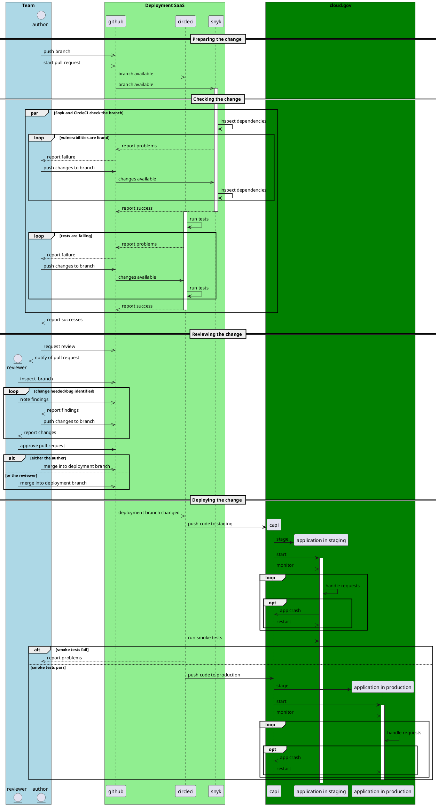

### Deploying a change to production code

The following interactions make a change happen in the production environment. A narrative explanation follows the diagram.
![CI/CD process](http://www.plantuml.com/plantuml/png/nLP1Z-mc33uFlyAQ7dgQzhvw-_JKNQcgr4FLxHzWY2T1Io05C-ty-n8dLeAIZRgdTqg0ppR-FcFubaX7ohrJr_0ldFz2tP_XXzzjsz4lBgCweITB3pX7l5ly1-CPT08PBCiwKnUcnUbNeM-W-5Jgnp8HVEwl1Q-Ud-6FY8EErhT07OBfj6yHdf_LP0UNhr-XjTJbwnCCENLmZTgRRc-Pzrv0pbqY_fqnaJeLrsID7RGdIFxnhauJcWsDZSQXiK-pKz1tRPs-EbG000kIJRSetlzBX-Pzitrse0tPkoPayt52gR8VU1j7sZVmml5VVWCp-c07KmYsPgEBnBO-3MW86XpGD-YDnSGm5y80z-myHdsrpb9P01qHRY7xXY6hPBvykLncZn67CF8LGqcbJuAS1MEaK2lOcxOkHwoXMurc6X9GM2Uqowb0Q-e_aNyPgSC4KpO6qmHkiD94dMgTf21uLWPmMLTAp1u84otayv0fPtwiRtT95nVVdtZPoH7vnyb_pBnW3zYlcHwTg8FCPtjCVDZ-v4xplvh5t0BcvgHCH4suj2hvgOFwGFRsW72hseY0wm1IaSBqM0ko9O_OOFFpDRTW6_J5gSM9hDhL4XRXPdrJCalgk1OMtESBGOBl-HKJLcHtbteOOhXZJOtIZW0B0kEeYRJxqyx6UemjWlKKnbFimgD7Jx8zT0aXJ3wM-qJ-Fk77DrmfhxoohPIzSx1rCniKL-iBv5mOSDPeii6N-918joN2UCt9Vq58gHazM5MTep8XyeG6WO9OpIQL4psmqJBrnF_uqKeanQUhzWC2h_5zy9P2v9fLfsLb0omqD0xbC4qr5mQ2fL6CxaivLLQZ9nDrwYhOndb4thSq4zQkOgm2Pm-f3-yuTo3jQ3tc5baVdQEco_LMsGzwxb97YXVp9fjnnAANLJOvLdbbnUXPR34MFHU9ONS-KdrPiReLjvMqSZs9123oVgZhHjjAttrXQt4tgegows-3wnGcqVcr-RgSmZUjt-JX-Mj4zDLBRku46xMgwtlpyfCNw1JCk92RdzfmBs5s8YphO8Ad69oR7xibsMs0fL0tIsLk2Vsj_ENU_GS0)

