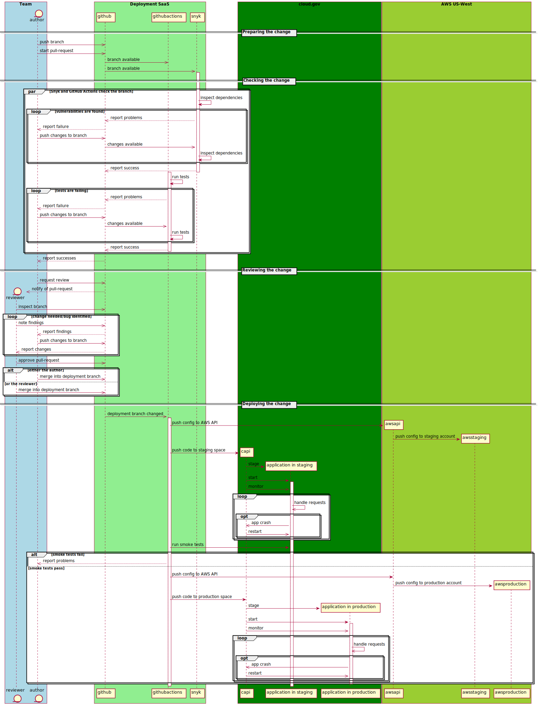
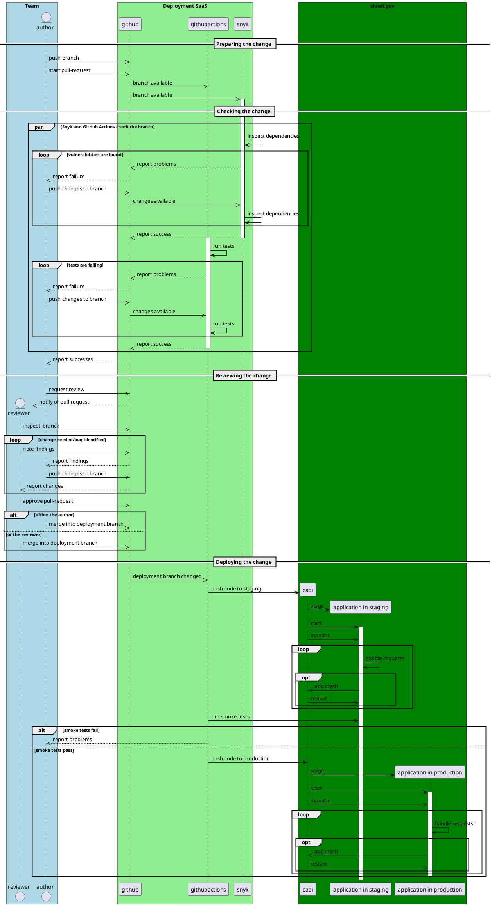

### Deploying a change to production code

The following interactions make a change happen in the production environment. A narrative explanation follows the diagram.

```plantuml
@startuml
box "Team" #LightBlue
	entity "reviewer" as reviewer
	entity "author" as author
end box

'autonumber

== Preparing the change ==
author ->> github: push branch
author ->> github: start pull-request
	participant snyk
	github ->> githubactions: branch available
    github ->> snyk: branch available

== Checking the change ==
    activate snyk    

par Snyk and GitHub Actions check the branch
    snyk -> snyk: inspect dependencies
    loop vulnerabilities are found
        github <<-- snyk: report problems
        author <<-- github: report failure
        author ->> github: push changes to branch
        github ->> snyk: changes available
        snyk -> snyk: inspect dependencies
    end
    github <<-- snyk: report success
    deactivate snyk
	
    activate githubactions
    githubactions -> githubactions: run tests
    loop tests are failing
        github <<-- githubactions: report problems
        author <<-- github: report failure
        author ->> github: push changes to branch
        github ->> githubactions: changes available
        githubactions -> githubactions: run tests
    end
    github <<-- githubactions: report success
    deactivate githubactions
end

author <<-- github: report successes

== Reviewing the change ==
author ->> github: request review
create reviewer
reviewer <<-- github: notify of pull-request
reviewer ->> github: inspect  branch
loop change needed/bug identified
    reviewer ->> github: note findings
    author <<-- github: report findings
    author ->> github: push changes to branch
    reviewer <<-- github: report changes
end
reviewer ->> github: approve pull-request

alt either the author
	author ->> github: merge into deployment branch
else or the reviewer
	reviewer ->> github: merge into deployment branch
end

== Deploying the change ==
github ->> githubactions: deployment branch changed

participant "application in staging" as stagingapp
create capi
githubactions -> capi: push code to staging
create stagingapp
capi -> stagingapp: stage
capi -> stagingapp: start
activate stagingapp 
capi ->> stagingapp: monitor
loop
	stagingapp ->> stagingapp: handle requests
    opt 
        capi <<- stagingapp: app crash
        capi ->> stagingapp: restart
    end
end

githubactions -> stagingapp: run smoke tests
alt smoke tests fail
    author <<-- githubactions: report problems
else smoke tests pass
    participant "application in production" as app
    githubactions -> capi: push code to production
    create app
    capi -> app: stage 
    capi -> app: start
    activate app 
    capi ->> app: monitor
    loop
        app ->> app: handle requests
        opt 
            capi <<- app: app crash
            capi ->> app: restart
        end
    end
    deactivate app
end

box "Deployment SaaS" #LightGreen
	participant github
    participant githubactions
    participant snyk
end box

box "cloud.gov" #Green
	participant "cloud.gov controller" as capi
    participant stagingapp
    participant app
end box

@enduml
```
