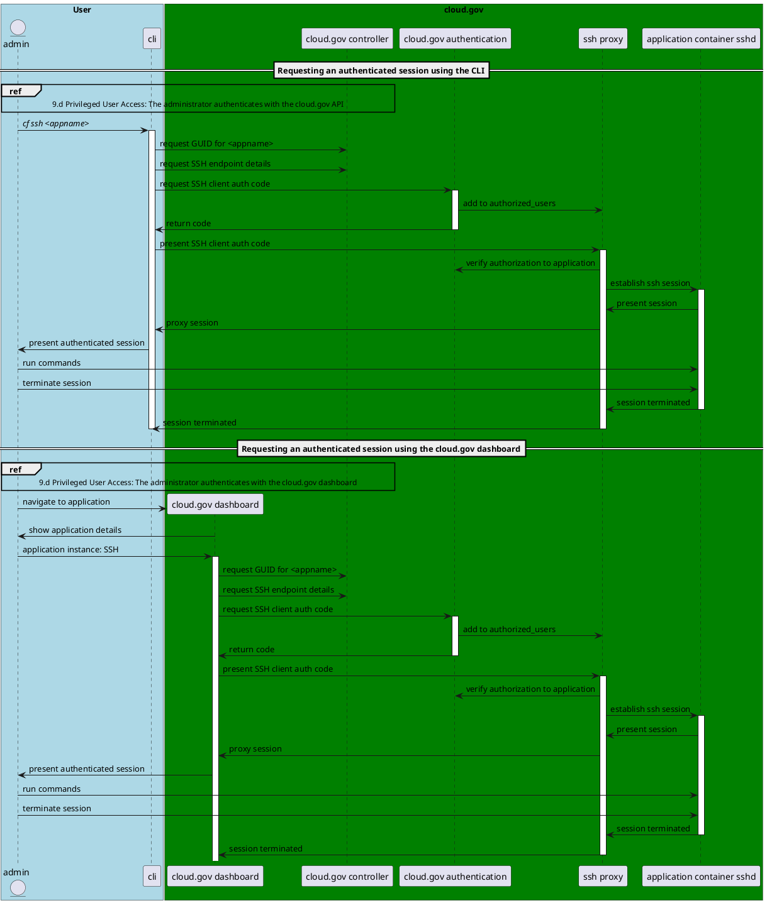

### Establishing a privileged session
The following interactions happen between cloud.gov systems when the data.gov team establishes an authenticated SSH session. See the Cloud Foundry documentation for additional details if necessary (https://docs.cloudfoundry.org/devguide/deploy-apps/ssh-apps.html#other-ssh-access).

